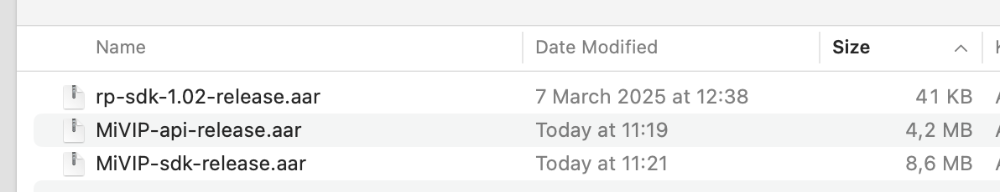

# MiVIP SDK Developer Guide

MiVIP’s Native SDK, available for iOS and Android, is a fully orchestrated user interface and user journey delivered as an SDK for seamless integration into any native application. The functionality is replicated from the existing Web journey where the same orchestration and white-label customisations are applied, as configured in one centralised location via the web portal. The SDK is packaged together with Mitek’s capture technology, MiSnap. Mitek’s customers can benefit from both Mitek’s market leading capture experience combined with a completely pre-built dynamic user journey, all delivered in a single packaged SDK with low code integration for minimum integration effort and accelerated time to live.

Supported identity sources:

* Face capture - guided capture (using MiSnap), active liveness or selfie capture
* Documents - POI/POA - guided capture (using MiSnap), upload document image or image + PDF for POA
* Document NFC reading - using MiSnap intelligent NFC orchestration
* Payment card
* Video - Assisted / Unassisted
* Signature
* Attachments
* Open banking
* Voice

SDK also includes wallet/account/history functionality.


## Installation

* Install MiSnap SDKs - [MiSnap-Android](https://github.com/Mitek-Systems/MiSnap-Android)
* On top of MiSnap - copy MiVIP SDKs to application libs folder:

<center>



<center>

* In app build.gradle file add local file dependancy

```
implementation fileTree(dir: 'libs', include: ['*.jar', '*.aar'])
```

## Configuration / customisation

* MiVIP backend URL - define MiVIP instance URL _strings.xml_

``` xml
        <string name="mivip_url" translatable="false">_MIVIP_INSTANCE_URL_</string>
```

* Company logo - add in _res/drawable_ your logo image and name it _mitek_logo_

* Main colours - predefine colours _colors.xml_

``` xml
        <color name="hy_header_color_start">#b01c24</color>
        <color name="hy_header_color_end">#b01c24</color>
        <color name="hy_main_color">#0E212F</color>
        <color name="hy_secondary_color">#fcc60a</color>
        <color name="hy_secondary_disabled">#e2dede</color>
        <color name="hy_button_gradient_start">#b01c24</color>
        <color name="hy_button_gradient_end">#b01c24</color>
        <color name="hy_alert_red">#d71e28</color>
        <color name="hy_yellow">#D38100</color>
        <color name="hy_green">#429448</color>
        <color name="hy_white">#ffffff</color>
        
        <!-- liveness -->
        <color name="liveness_instructions_background">@color/hy_secondary_color</color>
        <color name="liveness_instructions_background_done">@color/hy_green</color>
        <color name="liveness_instructions_text">@color/hy_white</color>
        
        <!-- qr code scanner line override -->
        <color name="scaner_border_line">@color/hy_secondary_color</color>
        <color name="scanner_line">@color/hy_main_color</color>
```


## Permissions for the main app
in AndroidManifest.xml ensure that app has these permissions:
``` xml
        <uses-permission android:name="android.permission.CAMERA" />
        <uses-permission android:name="android.permission.WRITE_EXTERNAL_STORAGE" />
        <uses-permission android:name="android.permission.INTERNET" />
        <uses-permission android:name="android.permission.ACCESS_NETWORK_STATE" />
        <uses-permission android:name="android.permission.READ_EXTERNAL_STORAGE" />
        <uses-permission android:name="android.permission.NFC" />
        <uses-permission android:name="android.permission.RECORD_AUDIO" />
        <uses-permission android:name="android.permission.MODIFY_AUDIO_SETTINGS" />
```

SDK will ask user to grant permission when it’s needed (e.g. Camera when capture image, Audio when starting MiPass voice, etc.)

Add also following features in AndroidManifest.xml:
``` xml
    	<uses-feature
            android:name="android.hardware.camera"
            android:required="true" />
        <uses-feature
            android:name="android.hardware.camera.autofocus"
            android:required="false" />
        <uses-feature
            android:name="android.hardware.camera.front"
            android:required="false" />
        <uses-feature
            android:name="android.hardware.camera.front.autofocus"
            android:required="false" />
        <uses-feature
            android:name="android.hardware.nfc"
            android:required="false" />
```

## SDK usage

* Start ID request activity with request QR code scan

``` kotlin
        btn_scan_qr.setOnClickListener {
            val intent = Intent(requireActivity(), MiVIPActivity::class.java).apply {
                putExtra(MiVIPActivity.SDK_FLAG, true) // mark we are in SDK mode
                putExtra(MiVIPActivity.ACTION_FLAG, com.hooyu.android.HooyuActivity.ACTION_QR) // go to QR screen
                putExtra(MiVIPActivity.SOUNDS_DISABLED, true) // default is False
                putExtra(MiVIPActivity.REUSABLE_ENABLED, false) // default is False
                putExtra(MiVIPActivity.ENABLE_SCREENSHOTS, true) // default is false
                putExtra(MiVIPActivity.SELFIE_CALLBACK_URL, selfieCallbackUrl) // if want to receive server callback at liveness/selfie processing
                putExtra(MiVIPActivity.DOCUMENT_CALLBACK_URL, docCallbackUrl) // if want to receive server callback at document processing
            }
            mivipActivityResult.launch(intent)
        }
```

* Open request with given MiVIP request ID

``` kotlin
        btn_request.setOnClickListener {
            val intent = Intent(requireActivity(), MiVIPActivity::class.java).apply {
                putExtra(MiVIPActivity.SDK_FLAG, true) // mark we are in SDK mode
                putExtra(MiVIPActivity.ACTION_FLAG, MiVIPActivity.ACTION_REQUEST) // open request
                val mivipRequestId = "8ec4dd13-ad90-4176-ba77-f57770af291d"
                putExtra(MiVIPActivity.MIVIP_REQUEST_ID, mivipRequestId) // ID request
                putExtra(MiVIPActivity.SELFIE_CALLBACK_URL, selfieCallbackUrl) // if want to receive server callback at liveness/selfie processing
                putExtra(MiVIPctivity.DOCUMENT_CALLBACK_URL, docCallbackUrl) // if want to receive server callback at document processing
                putExtra(MiVIPActivity.SOUNDS_DISABLED, false) // this is the default value (sounds on)
                putExtra(MiVIPActivity.REUSABLE_ENABLED, false) // this is the default value (wallet off)
                putExtra(MiVIPActivity.ENABLE_SCREENSHOTS, true) // default is false
            }
            mivipActivityResult.launch(intent)
        }
```

* Show requests history

``` kotlin
        btn_history.setOnClickListener {
            val intent = Intent(requireActivity(), MiVIPActivity::class.java).apply {
                putExtra(MiVIPActivity.SDK_FLAG, true) // mark we are in SDK mode
                putExtra(MiVIPActivity.ACTION_FLAG, MiVIPActivity.ACTION_HISTORY) // go to history screen
                putExtra(MiVIPActivity.SOUNDS_DISABLED, false) // this is the default value
                putExtra(MiVIPActivity.REUSABLE_ENABLED, false) // this is the default value
                putExtra(MiVIPActivity.ENABLE_SCREENSHOTS, true) // default is false
            }
            startActivity(intent)
        }
```

* Show user account (if wallet enabled)

``` kotlin
        btn_account.setOnClickListener {
            val intent = Intent(requireActivity(), MiVIPActivity::class.java).apply {
                putExtra(MiVIPActivity.SDK_FLAG, true) // mark we are in SDK mode
                putExtra(MiVIPActivity.ACTION_FLAG, MiVIPActivity.ACTION_ACCOUNT) // go to account screen
                putExtra(MiVIPActivity.ENABLE_SCREENSHOTS, true) // default is false
            }
            startActivity(intent)
        }
```

* Get SDK results (for request based activities)

``` kotlin
        private val mivipActivityResult = registerForActivityResult(ActivityResultContracts.StartActivityForResult()) {
            MiVIPActivity.Result.result?.let { res ->
                res.scoreResult?.let {
                    Log.i("MIVIP", "Score result $it")
                }
                res.request?.let {
                    Log.i("MIVIP", "Resuest $it")
                }
            }
            MiVIPActivity.Result.clearResult()
        }
```

## SDK files
* MiVIP-api-3.3.4-release.aar - includes API calls and handle results. Size - 4.2MB
* MiVIP-core-3.3.4-release.aar - implementation of active liveness and core functionality. Size - 254KB
* MiVIP-sdk-3.3.4-release.aa - includes journey orchestration and UI. Size - 8.4MB

## System Requirements

<center>

| Technology | version |
| :--- | :---: |
| MiSnap | 5.5.0 |
| Android Gradle Plugin | 8.3.0 |
| Gradle | 8.4 |
| Kotlin | 1.8.10 |
| CameraX | 1.3.0 |
| JDK | 1.8 |
| Android min API level | 24 |
| Android target API level | 34 |

</center>
